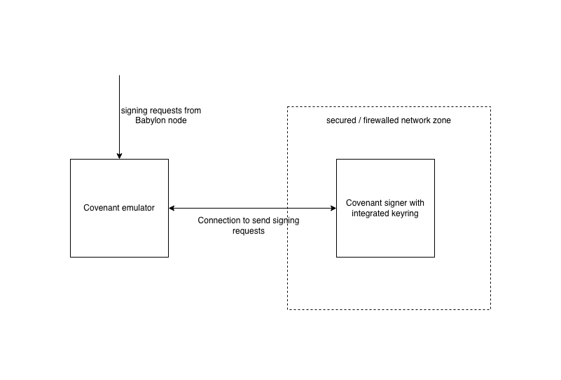

# Covenant Emulation Toolset

## Overview

The covenant emulation toolset is a set of programs operated by every member of 
the covenant committee of the BTC staking protocol. The role of the covenant 
committee is to protect PoS systems against attacks from the BTC stakers and 
finality providers. It achieves this by representing itself as an M-out-of-N 
multi-signature that co-signs BTC transactions with the BTC staker.

More specifically, through co-signing, the covenant committee enforces the 
following three spending rules of the staked bitcoins, the equivalence of 
which is common for PoS systems:

1. If the staker is malicious and gets slashed, the percentage of the slashed
bitcoins must satisfy the protocol's fractional slashing percentage.

2. If the staker is malicious and gets slashed, the destination address of the 
slashed bitcoins must be the unique slashing address specified by the 
protocol, not any other address.

3. when the staker unbonds, the unbonding time must be no shorter than the 
protocol's minimum stake unbonding time.

Besides enforcing rules via co-signing, the covenant committee has no other 
duty or power. If it has a dishonest super majority, then

* it can:

  * refuse to co-sign, so that no bitcoin holders can stake. In this case, 
    no bitcoin will be locked because the protocol requires the committee to 
    pre-sign all the transactions, and

  * collude with the stakers, so that the staker can dodge slashing.

* it cannot:
 
  * steal the staker's bitcoins, because all the spending transactions
    require the staker's signature;
  
  * slash the staker's bitcoins by itself, because slashing requires the 
    secret key of the finality provider, which the covenant committee does 
    not know in advance, and
   
  * prevent the staker from unbonding or withdrawing their bitcoins, again,
    because the protocol requires the committee to pre-sign all the transactions.

In other words, there is no way the committee can act against the stakers, 
except rejecting their staking requests. Furthermore, the dishonest actions 
of the covenant committee can be contained by 1) including the staker's 
counterparty in the committee, such as the PoS system's foundation, or 2) 
implementing a governance proposal to re-elect the committee.

This rule-enforcing committee is necessary for now because the current BTC 
protocol does not have the programmability needed to enforce these rules by 
code. This committee can be dimissed once such programmability becomes 
available, e.g., if BTC's covenant proposal [BIP-119](https://github.com/bitcoin/bips/blob/master/bip-0119.mediawiki)
is merged.

Covenant emulation committee members are defined in the Babylon parameters and 
their public keys are recorded in the genesis file of the Babylon chain. 
Changing the covenant committee requires a 
[governance proposal](https://docs.cosmos.network/v0.50/build/modules/gov). 
Each committee member runs two components:

1. **Covenant Signer**: The Covenant Signer operates in tandem with the Covenant Emulator and
   is purpose-built to securely manage private keys for signing operations.
   It prioritizes security through isolation,
   ensuring that private key handling is confined to an instance with
   minimal connectivity and simpler application logic compared to the
   Covenant Emulator daemon.
2. **Covenant Emulator**: The covenant emulator constantly monitors staking
   requests on the Babylon chain, verifies the validity of the
   Bitcoin transactions that are involved with them,
   and if verification is passed,
   generates the necessary signatures through a connection to the
   covenant-signer and sends them to the Babylon blockchain. Specifically,
   it deals with the following signatures:
   1. **Slashing signature**. This signature is an [adaptor signature](https://bitcoinops.org/en/topics/adaptor-signatures/),
      which signs over the slashing path of the staking transaction. Due to the
      [recoverability](https://github.com/LLFourn/one-time-VES/blob/master/main.pdf)
      of the adaptor signature, it also prevents a malicious finality provider from
      irrationally slashing delegations.
   2. **Unbonding signature**. This signature is a [Schnorr signature](https://en.wikipedia.org/wiki/Schnorr_signature),
      which is needed for the staker to unlock their funds before the original
      staking time lock expires (on-demand unbonding).
   3. **Unbonding slashing signature**. This signature is also an adaptor
      signature, which has similar usage to the **slashing signature** but signs over
      the slashing path of the unbonding transaction.

The staking requests can only become active and receive voting power if a 
sufficient quorum of covenant committee members have verified the validity 
of the transactions and sent corresponding signatures.

## Interaction Between Emulator and Signer

The Covenant Emulator handles the application logic, including monitoring the 
Babylon blockchain and validating transactions. When a signature is needed, it 
forwards the request to the Covenant Signer, which processes the signing operation 
and returns the necessary cryptographic signature.

The interaction begins with the Covenant Emulator monitoring the Babylon 
blockchain for new staking requests. The emulator then prepares the necessary 
signing data, which includes transactions requiring slashing signatures 
(adaptor signatures), unbonding signatures (Schnorr signatures), and 
unbonding slashing signatures (adaptor signatures). This data is then forwarded 
to the Covenant Signer.

This flow ensures that all private key operations remain isolated within the 
secure Covenant Signer while the emulator handles the blockchain interaction 
and validation logic.

## Boot Order and Dependencies

The Covenant Emulator requires the Covenant Signer to be running and unlocked 
before it can start. This is because the emulator performs a health check
during startup to ensure the signer is accessible and ready to handle signing requests.
If the signer is not running or is locked, the emulator will fail to start with a clear error message.

The required boot sequence is:
1. Start and unlock the Covenant Signer
2. Verify the signer is running and accessible
3. Start the Covenant Emulator

The emulator will automatically verify the signer's availability 
during startup and will not proceed if the signer is not ready.

## Covenant Emulator Stack Setup
To set up your covenant emulator stack,
please follow the instructions in the following documents
(in sequence):
1. [Covenant Signer Setup](./docs/covenant-signer-setup.md)
2. [Covenant Emulator Setup](./docs/covenant-emulator-setup.md)

## Important Limitations

**Keyring Backend**: The covenant emulator only supports the `test` 
keyring backend. This limitation exists because the emulator requires automated
signing capabilities without manual passphrase entry. Other keyring backends 
will cause the emulator to fail at startup.
